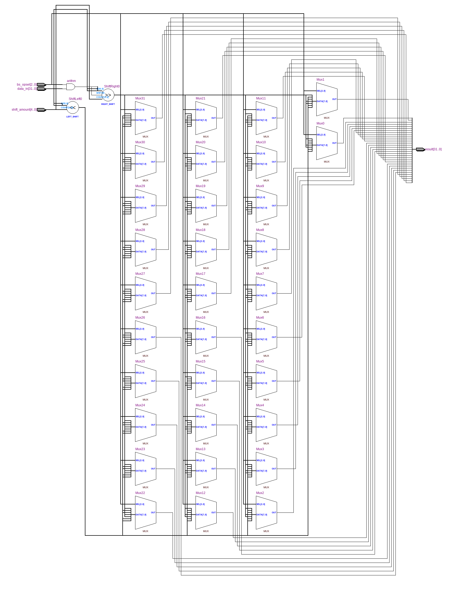
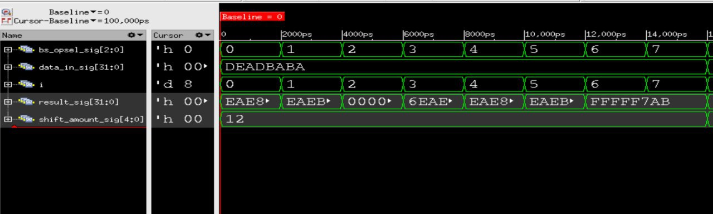

=============================================
Лабораторна робота №3
=============================================

Тема
------

Створення та верифікація пристрою швидкого зсуву

Хід роботи
-------

**Специфікація** Пристрій повинен виконувати такі види зсуву:
	- SLL (shift left logical)- Логічний зсув вліво

        - SRL (shift right logical)- Логічний зсув вправо

        - ROL (rotate left)- Циклічний зсув вліво

        -  ROR (rotate right)- Циклічний зсув вправо

        -  SRA (shift right arithmetical)- Арифметичний зсув вправо
	
Barrel shifter (пристрій швидкого зсуву) — цифрова електронна схема, яка виконує зсув даних на вказане число позицій за один такт синхронізації.
 Пристрій швидкого зсуву також може виконувати циклічний зсув і розширення знакового біта.[1]

Для реалізації даного пристрою було принято використати мову опису апаратури Verilog. Barrel Shifter [Електронний ресурс] Режим доступу: <https://uk.wikipedia.org/wiki/Barrel_shifter> 
Для керування "Barrel Sgifter" було реалізовано 2 сигнала: shift_amout, bs_opsel.

Де за кількісь біт здвигу відповідає сигнал shift_amout, а вибору типу звигу відповідає bs_opsel. 

Проект було вирішено створювати на мові Verilog, тому що це зайняло набагато менше часу, ніж створення схеми
у схемному редакторі.

Також додатковою умовою до завдання була реалізація взаємозамінності модулів. Дотриматись цієї умови можна було
завдяки стандартизації назв входів і виходів пристрою. І перевірити взаємозамінність можна було обмінявшись із товаришем файлами проекту
і запустивши тестовий файл, який призначався для мого файлу проекту, на пристрої товариша. Я обмінявся із Гліб Ковальов. Ідея реалізації у нас
однакова. Різниця лише у стилі коду та деяких моментах в коді. Після перевірки пристрою Глібa  моїм тестовим файлом він вів себе ідентично моєму. 
Тобто при подачі одних і тих самих сигналів на входи, на виході я отримував те саме, що і у своєму пристрої.

Так виглядає RTL схема цього регістрового файлу

Так виглядає частина Waveform симуляцii

Висновки
-------

В ході виконання лабароторної роботи було реалізовано "регістр швидкого звдигу". Який повністю відповідає поставленому завданню, а саме: він виконує операцію сдвигу за один тактовий імпульс,
 виконує всі здвиги, які є в завданні. Дані твердження були перевірені в симуляторі.

  Також було засвоєно нові констукції на мові Verilog, які можуть допомогти нам в майбутніх проектах.
Мій звіт був побудований на основі звіту Шліхти, та деякі елементи були взяті у Лаврусента,так як його опис мені дуже сподобався

