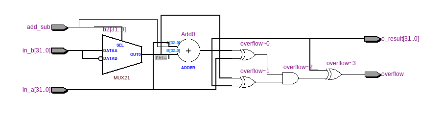
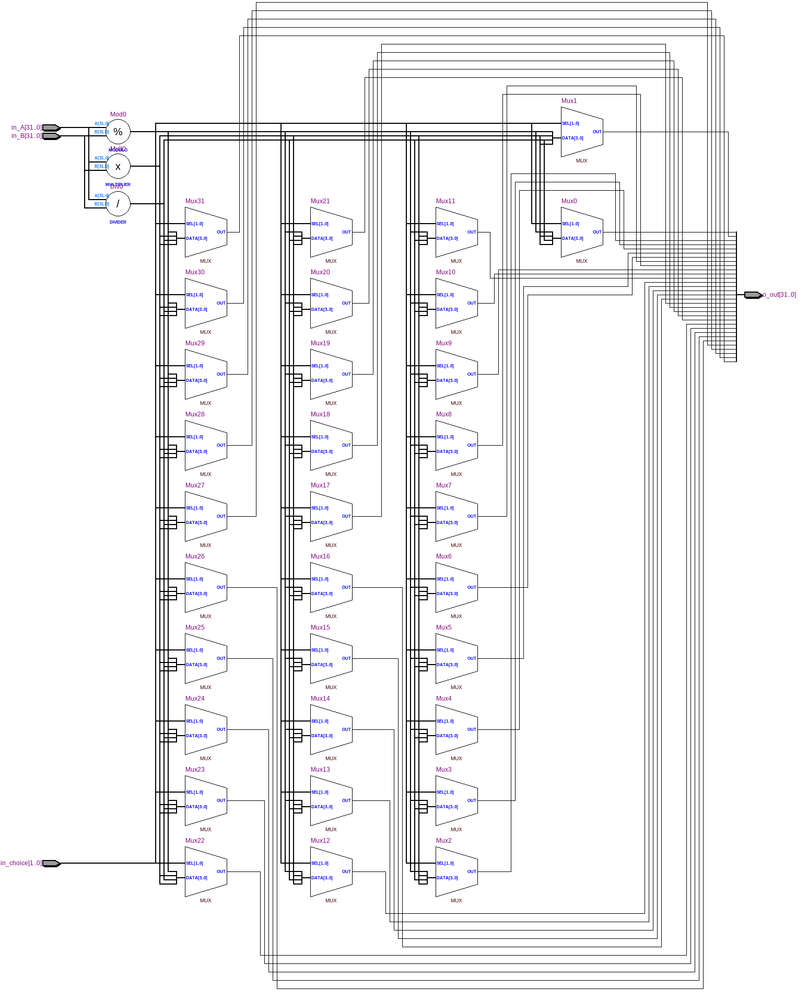
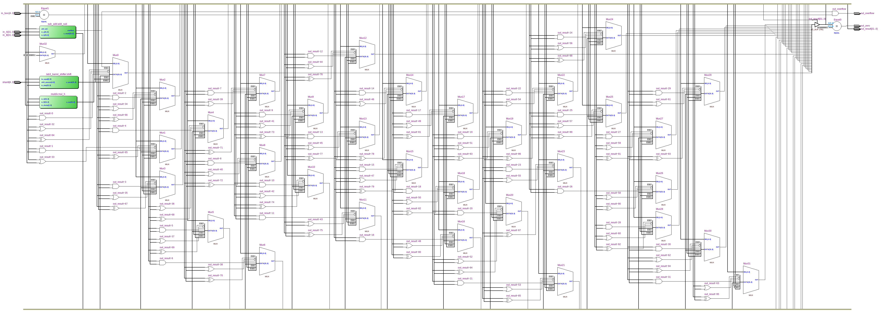

=============================================
Лабораторна робота №4
=============================================

Тема
------

Створення та верифікація АЛП

Хід роботи
-------

Специфікація Пристрій повинен виконувати такі операції:

Арефметичний/логічний зсув (використано "Barrel shifter із Лабараторної роботи №3")

Сумувати знакові та беззнакові числа

Цілочисельне множення/ділення

Побітові операції AND, OR, NOR, XOR

Реалізувати прапорці zero, overflow

Tут було використано, barrel shifter з попередньої лабораторної роботи, який не потребував відладки, 
що також трохи спростило створення та відладку пристрою.у мого АЛП 2 входи данних, один з яких - вихід данних. Також у пристроя 2 виходи прапорців:
  -> overflow - прапорець переповнення(фактично нам потрібен тільки при операціях додавання та віднімання, тому він дає коректну інформацію тільки
при цих операціях, при інших операціях не слід на нього звертати увагу.
  -> zero - прапорець нуля(якщо на виході маємо нуль, то значення прапорця набуває значення 1).
Операція, яку повинен виконати АЛП задається п'ятьма бітами адреси, де найстарші два біти відповідають за "тип" операції(зсув/арифметика/логіка),
а три молодшіі біти задають конкретно операцію, яку ми хочемо, щоб АЛП виконав.
Проект сворювався на мові Verilog, тому що це занімає менше часу, ніж створення схеми
у схемному редакторі. Для спрощення роботи над пристроєм мною було вирішено кожну дію виконати в окремому файлі. 
що дуже сильно спростило відладку пристрою. Потім мною було написано тестовий файл на мові Verilog, що допомогло відладити пристрій.

 Результат всіх операцій розміщується у result_l. 

Вихід та входи даних мають розрядність 32 біти. 
проект складається з декількох модулів. 
Розглянемо RTL схеми деяких з цих модулів.

Так виглядає RTL схема модуля суматора-віднімача.

Так виглядає RTL схема модуля для множення та ділення.

Так виглядає RTL схема головного модуля АПЛ.

.. image:: media/waveform.png
Так виглядає частина Waveform симуляції

Висновки
-------
В даній лабароторній роботі було реалізовано "АЛП".для керування ним потрібен блок та память програм.Для перевірки було використано середовище Cadence Incisive,
 "вейформа" роботи АЛП прикріплена до PR, пристрій працює коректнo
.ALU повністю відповідає поставленому завданню, 
а саме: він виконує операцію сдвигу за один тактовий імпульс, виконує всі здвиги, які є в завданні. 
Тажож він додає та віднімає знакові та беззнакові числа, ділить, множить, виконує логічні операції. 
Також було написано test bench.Розроблений пристрій має 2 тридцятидвох розрядні входи даних(під операндами A і B).

Цей звіт я робив з огляду на минулі , вже оформлені і здані роботи Шліхти Олександра, Волинка Назара та Коцюбайла Антона

